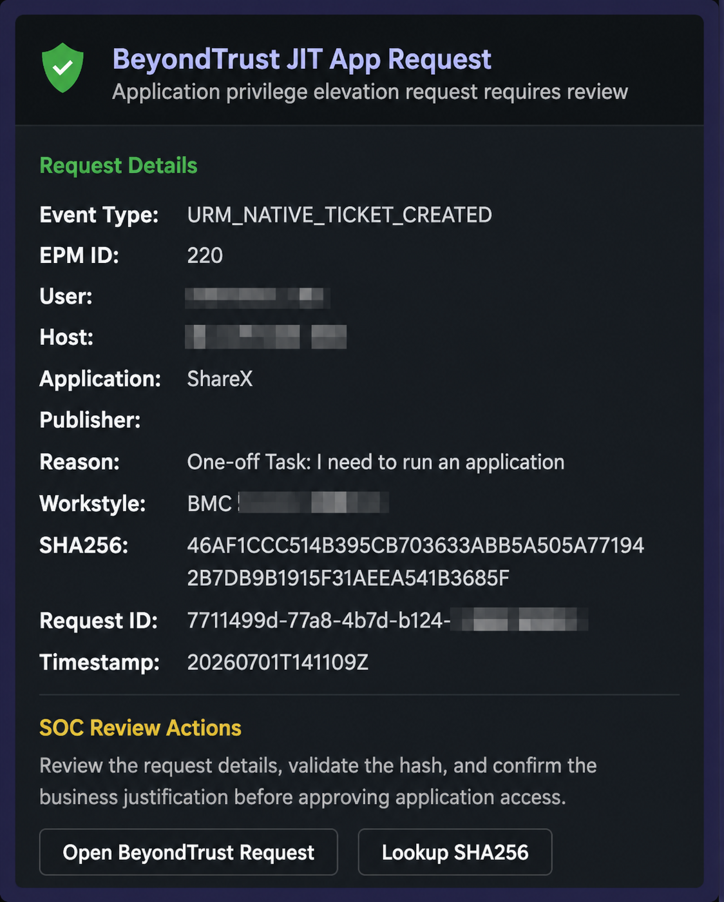

## Screenshot



# BeyondTrust EPM Teams Webhook Notifications

A portfolio-safe automation project for sending BeyondTrust Endpoint Privilege Management workflow notifications to Microsoft Teams using webhooks.

This repository demonstrates how endpoint privilege events, Just-in-Time access requests, application elevation requests, and approval workflows can be routed into Microsoft Teams for SOC visibility and analyst response.

## Project Goals

- Send BeyondTrust EPM workflow notifications to Microsoft Teams.
- Improve SOC visibility for JIT admin and application elevation requests.
- Standardize approval notification format.
- Provide simple webhook and Adaptive Card examples.
- Keep secrets and production data out of GitHub.

## Architecture

```text
BeyondTrust EPM Workflow
        ↓
Webhook Trigger
        ↓
Python / Webhook Handler
        ↓
Microsoft Teams Incoming Webhook
        ↓
SOC Notification Channel
```

## Example Use Cases

| Use Case | Description |
|---|---|
| JIT Admin Request | Notify SOC when a user requests temporary admin rights |
| Application Elevation Request | Notify SOC when a user requests app elevation |
| Permanent Exception Review | Route exception requests to a review channel |
| Blocked Application Alert | Notify analysts about blocked tools or risky binaries |
| macOS EPM Request | Surface macOS privilege requests to Teams |

## Repository Structure

```text
beyondtrust-teams-webhook-notifications/
├── README.md
├── src/
│   ├── send_teams_message.py
│   └── send_adaptive_card.py
├── examples/
│   ├── simple-message-payload.json
│   ├── adaptive-card-payload.json
│   └── beyondtrust-sample-event.json
├── docs/
│   ├── setup-guide.md
│   ├── teams-webhook-guide.md
│   └── beyondtrust-workflow-notes.md
├── templates/
│   ├── jit-admin-message-template.md
│   └── app-elevation-message-template.md
├── .env.example
├── .gitignore
├── requirements.txt
├── SECURITY.md
└── LICENSE
```

## Quick Start

Install requirements:

```bash
python3 -m venv venv
source venv/bin/activate
pip install -r requirements.txt
```

Create your local environment file:

```bash
cp .env.example .env
nano .env
```

Run a test message:

```bash
python3 src/send_teams_message.py
```

Run a test Adaptive Card:

```bash
python3 src/send_adaptive_card.py
```

## Example Notification

```text
BeyondTrust JIT Admin Request

User: jsmith
Host: WIN10-TEST-01
Request Type: Temporary Admin
Duration: 24 hours
Reason: Install approved business application
Status: Pending Review
```

## Resume Talking Point

> Built a BeyondTrust EPM to Microsoft Teams webhook notification workflow to route JIT admin and application elevation requests into SOC channels, improving visibility, approval tracking, and analyst response consistency.

## Security Notice

Do not commit real webhook URLs, API keys, user data, hostnames, screenshots, customer data, or production logs.
